**Índice**   
1. [AWS SERVER DOCUMENTATION](#id1)
2. [AGREGAR IP ELÁSTICA](#id2)
3. [GESTIÓN DE DNS](#id3)
4. [VIRTUAL HOSTS](#id4)
5. [SERVIDOR FTP](#id5)

# <u>AWS SERVER DOCUMENTATION</u>

* **Conexión al servidor**
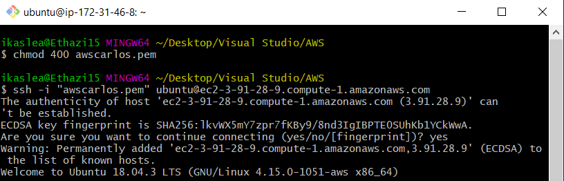

* **Actualizar Ubuntu**
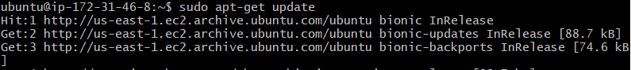

* **Instalación de Apache2**
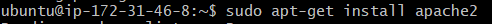

* **Instalación de MYSQL**
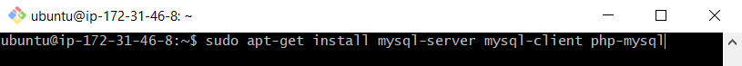
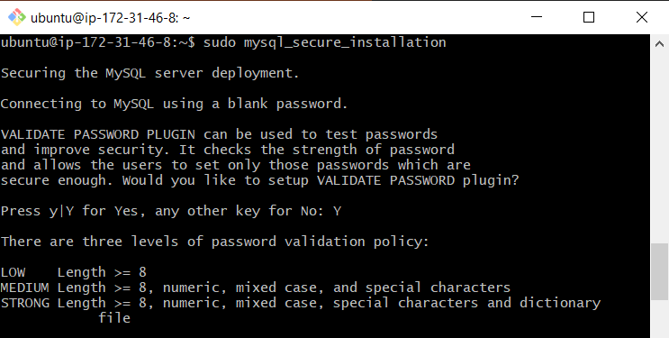
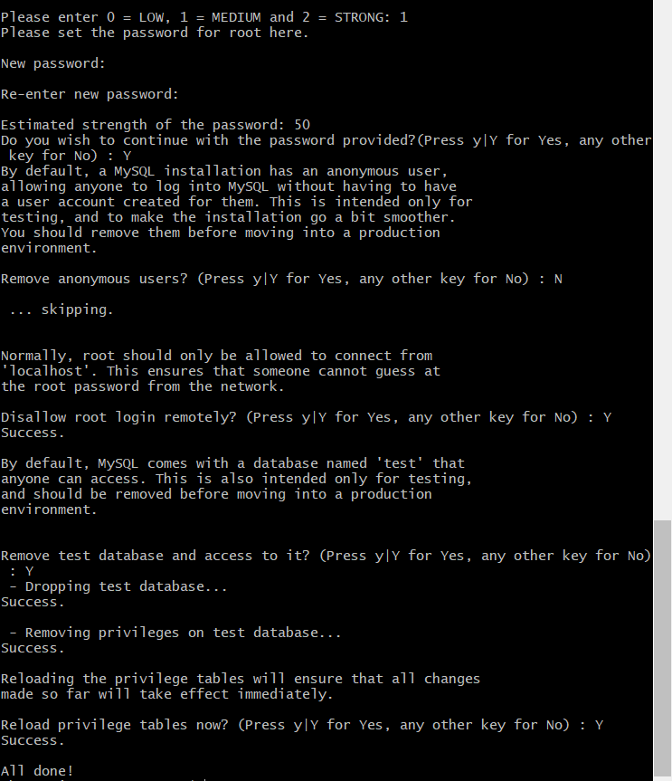
*contraseña: carlos20*

* **Instalación de PHP**
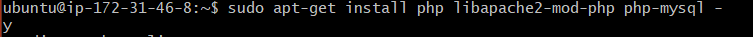
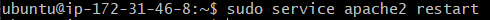
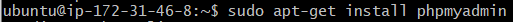

# <u>AGREGAR IP ELÁSTICA</u>

* **Clickr en el menú "Elastic IPs"**
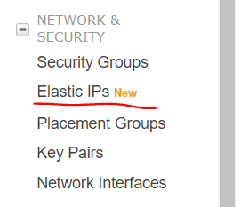

* **Añadir direccion**
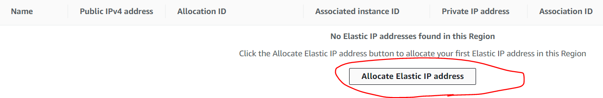
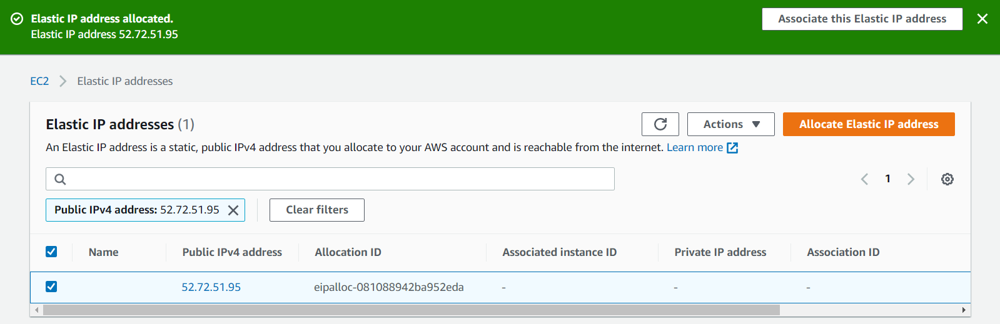

* **Asociar IP elástica**
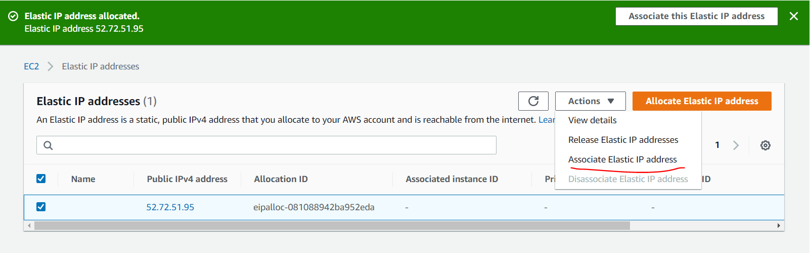
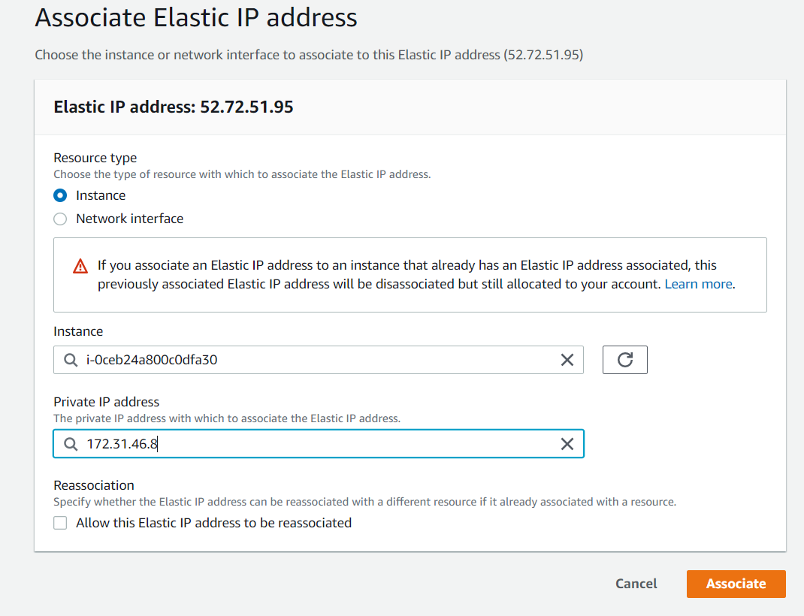

# <u>GESTIÓN DE DNS</u>

* **En la página de www.gestionservicios.online**
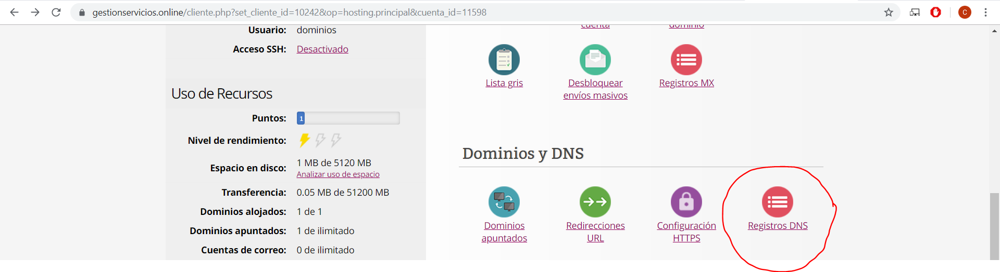
* **Rellenamos datos**
    * Nombre de la página
    * Tiempo de vida
    * Tipo de registro DNS
    * Dirección IPv4.
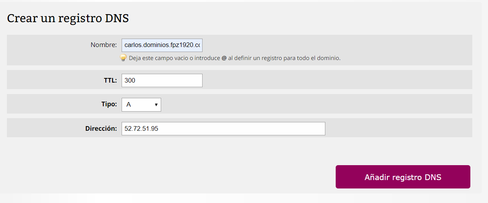

* **Resultado**
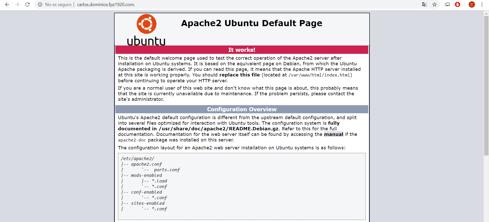

# <u>VIRTUAL HOSTS</u>

* **Crea carpetas ('servidor' y 'cliente') en /var/www con index.html diferentes**
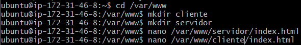
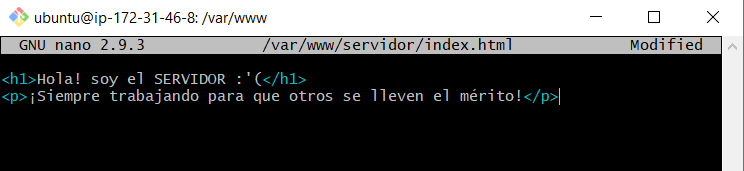
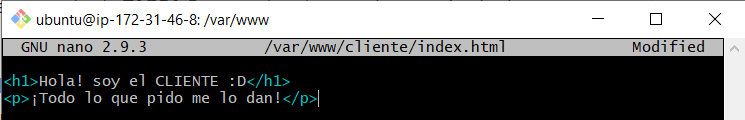

* **Crae dos subdominios:**
    * cliente-tunombre.dominios.fpz1920.<i></i>com
    * servidor-tunombre.dominios.fpz1920.<i></i>com
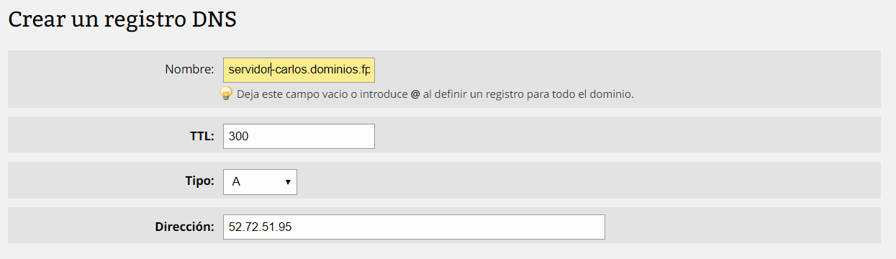

* **Dar permisos para su uso**
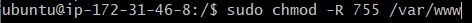

* **Añadir carpetas a sitesaviable**
    * Añadir carpetas cliente y servidor
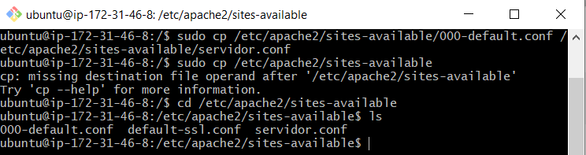
    * Editar la dirección y el nombre
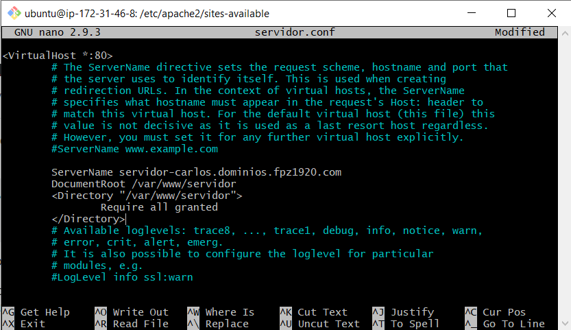
    * Aplicar a2ensite
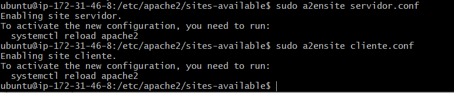

* **Reinicar apache para comprobar los resultados**
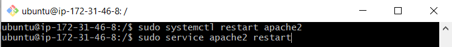
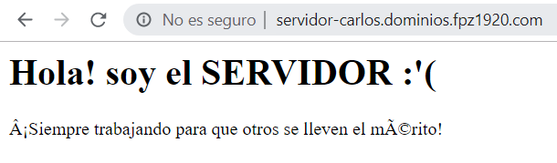

# <u>SERVIDOR FTP</u>
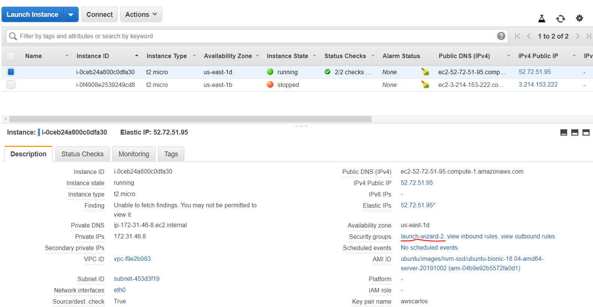
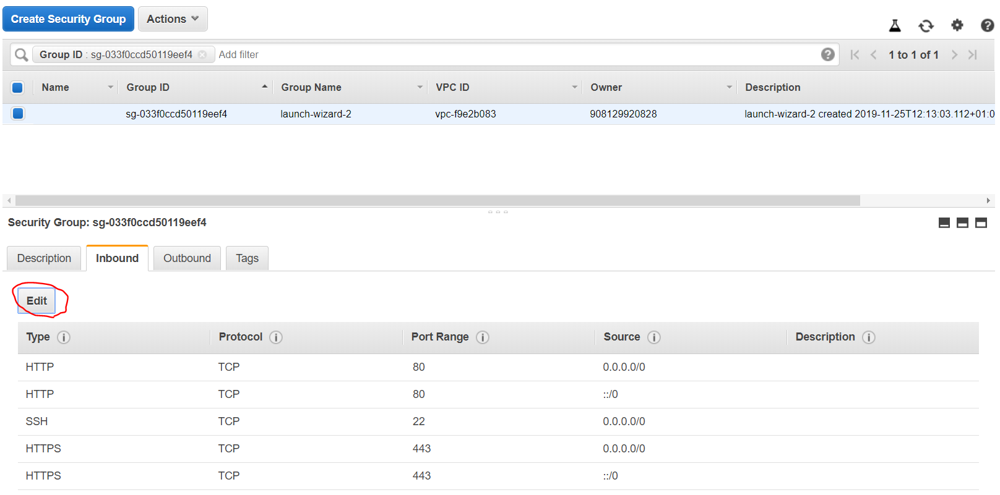
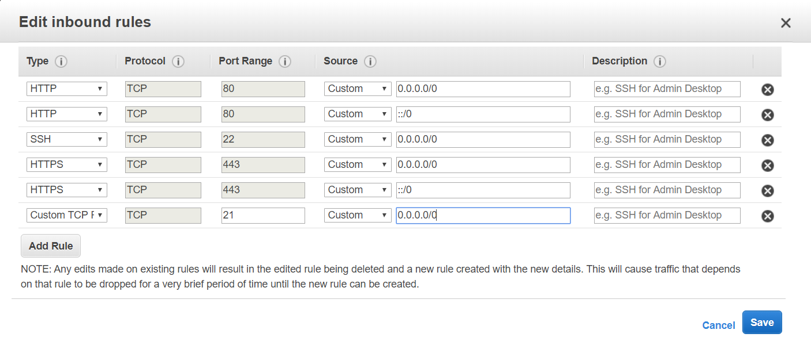
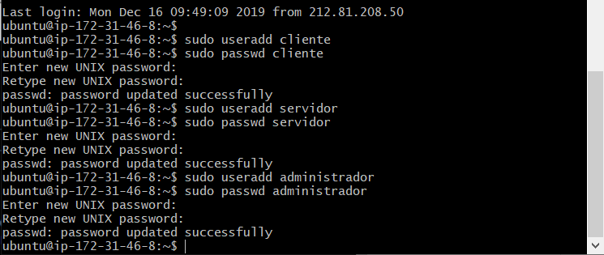
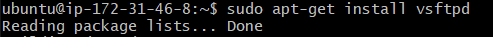

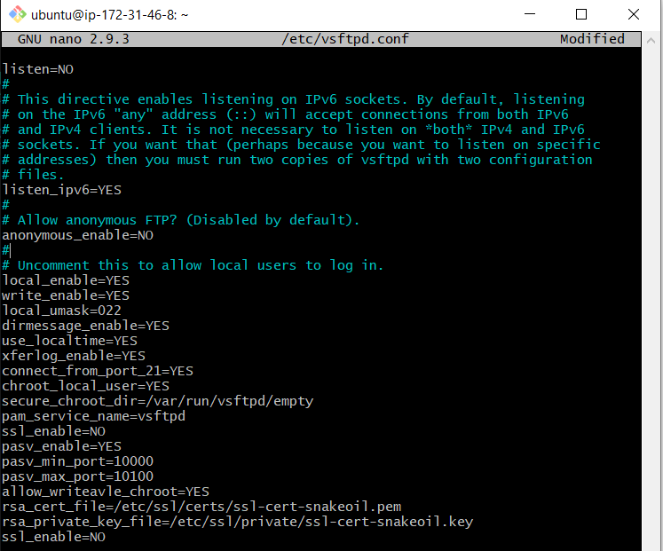
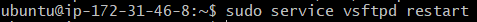
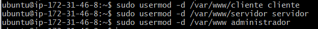

