**Índice**   
1. [AWS SERVER DOCUMENTATION](#id1)
2. [AGREGAR IP ELÁSTICA](#id2)
3. [GESTIÓN DE DNS](#id3)
4. [VIRTUAL HOSTS](#id4)
5. [SERVIDOR FTP](#id5)
6. [COPIAS DE SEGURIDAD](#id6)
7. [AUTOMATIZAR COPIAS DE SEGURIDAD](#id7)
8. [INSOMNIA](#id8)

# <u>AWS SERVER DOCUMENTATION</u>

* **Conexión al servidor**

* **Actualizar Ubuntu**

* **Instalación de Apache2**

* **Instalación de MYSQL**

*contraseña: carlos20*

* **Instalación de PHP**

# <u>AGREGAR IP ELÁSTICA</u>

* **Clickr en el menú "Elastic IPs"**

* **Añadir direccion**

* **Asociar IP elástica**

# <u>GESTIÓN DE DNS</u>

* **En la página de www.gestionservicios.online**

* **Rellenamos datos**
    * Nombre de la página
    * Tiempo de vida
    * Tipo de registro DNS
    * Dirección IPv4.

* **Resultado**

# <u>VIRTUAL HOSTS</u>

* **Crea carpetas ('servidor' y 'cliente') en /var/www con index.html diferentes**

* **Crae dos subdominios:**
    * cliente-tunombre.dominios.fpz1920.<i></i>com
    * servidor-tunombre.dominios.fpz1920.<i></i>com

* **Dar permisos para su uso**

* **Añadir carpetas a sitesaviable**
    * Añadir carpetas cliente y servidor

    * Editar la dirección y el nombre

    * Aplicar a2ensite

* **Reinicar apache para comprobar los resultados**

# <u>SERVIDOR FTP</u>

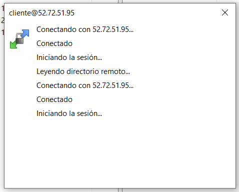

# <u>Copias de seguridad</u>
* **Crear copias tipo tar**

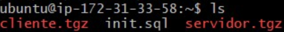
* **Crear una BBDD y copia**
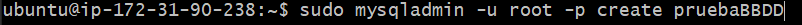
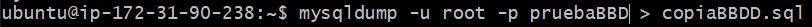
* **Comprobación**

# <u>Automatización de copias de seguridad</u>
* **Creamos una carpeta 'backup'**
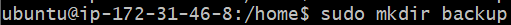
* **Creamos un PHP que ejecute el .sh**
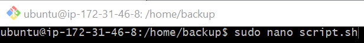
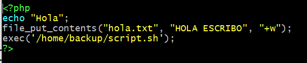
* **Creamos el .sh**
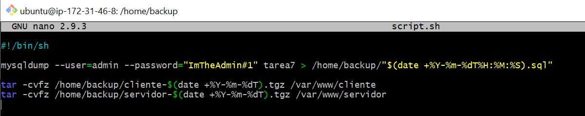
* **Dar permisos a la carpeta que contiene el .php**
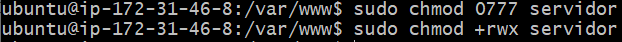
* **Dar permisos a la carpeta de backups**
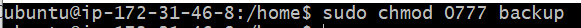
* **Cambiar usuarios**
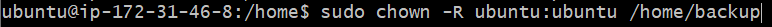
* **Creamos con crontab para hacer el backup**
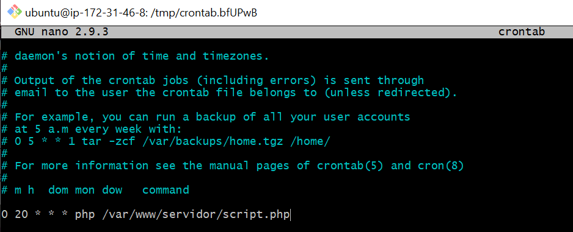

# <u>INSOMNIA</u>
## Tarea1
* **configurar el .htcacces para recibir el path y redireccionar al .php**

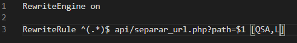

* **configurar el .htcacces para recibir el path y redireccionar al .php**

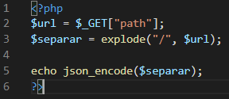

## Tarea2
* **El php procesa los datos y recibe lo siguiente**

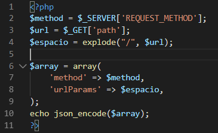

* **GET**

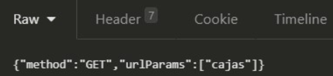

* **POST**

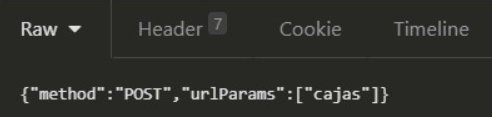

* **DELETE**

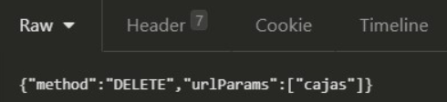

* **PUT**

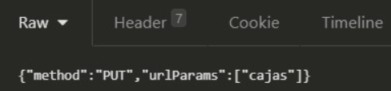

## Tarea3
* **Crear la conexión con la BBDD**
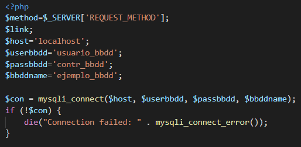

* **Crear un CASE para abarcar todas las posibilidades**
    * **GET**
    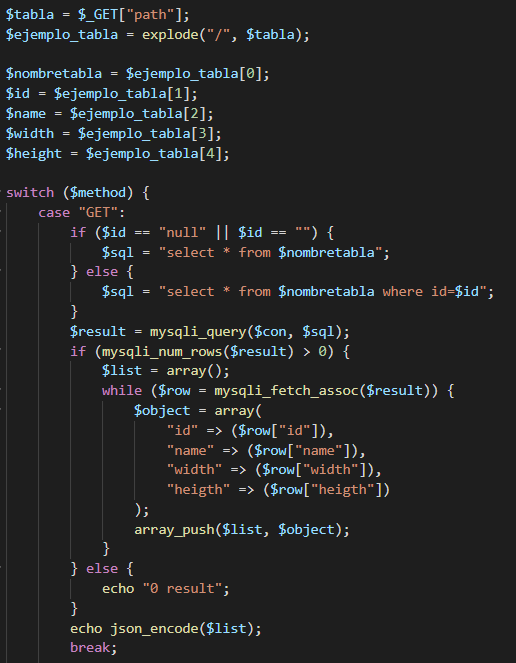
    * **POST**
    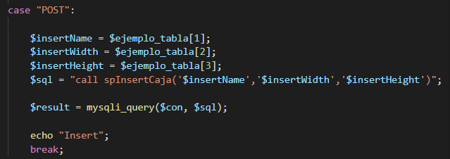
    * **PUT**
    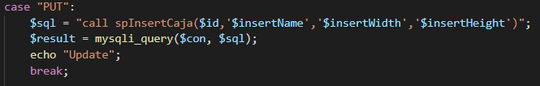
    * **DELETE**
    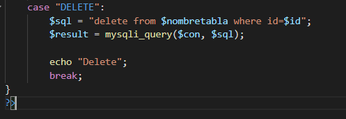
